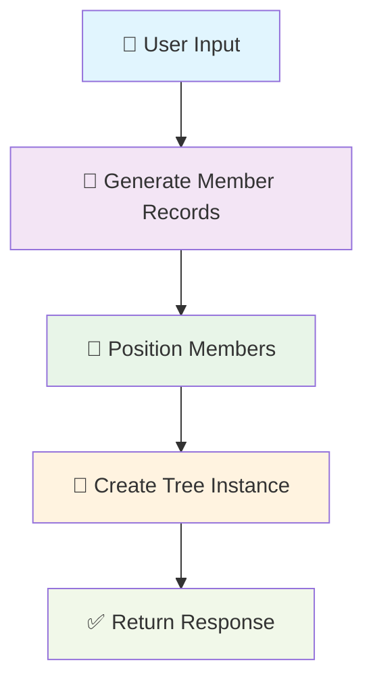

# 🌳 Family Tree Services

This directory contains the core business logic for managing family trees and their members. The services handle complex operations like tree creation, member positioning, and relationship management.

## 🚀 Tree Creation Process

The tree creation process is a multi-step operation that transforms raw family member data into a structured, positioned family tree.

### 📋 Overview



### 🔄 Detailed Flow

#### 1. 📝 **Input Validation** 
- **Function**: `createTree(createData: ManageTreeRequestPayload)`
- **Purpose**: Validates user permissions and input data
- **Checks**: 
  - User exists and is authenticated
  - Required fields are present
  - Data structure is valid

#### 2. 👥 **Generate Member Records**
- **Function**: `generateTreeMembersRecords(members: APIFamilyMemberDAO[], userId: number)`
- **Purpose**: Creates database records for all family members
- **Process**:
  - Filters out existing members (prevents duplicates)
  - Calculates age from date of birth
  - Converts relationship arrays to JSON strings
  - Bulk creates new `FamilyMember` records
  - Returns mapped records keyed by `node_id`

```typescript
// Example transformation
{
  node_id: "member_123",
  first_name: "John",
  last_name: "Doe",
  age: 30, // calculated from dob
  children: "[]", // JSON stringified
  parents: "[]",  // JSON stringified
  // ... other fields
}
```

#### 3. 📍 **Position Family Members**
- **Function**: `positionFamilyMembers(members: FamilyMember[], anchorNodeId: string)`
- **Purpose**: Calculates visual positions for all family members
- **Process**:
  - **Anchor Selection**: Uses the specified anchor node as the center point
  - **Relationship Positioning**: Positions relatives based on kinship type:
    - 👶 **Children**: Below anchor, horizontal spread
    - 👥 **Siblings**: Same level as anchor, horizontal spread  
    - 💑 **Spouses**: Same level as anchor, horizontal spread
    - 👴 **Parents**: Above anchor, horizontal spread
  - **Coordinate Calculation**: Uses offset-based positioning with 125px spacing
  - **Connection Mapping**: Creates connection objects for visual links

```typescript
// Position calculation example
const offset = {
  x: initialPosition.x + (125 * (nodeIndex + 1)),
  y: initialPosition.y + 125 // for children
};
```

#### 4. 🌳 **Create Tree Instance**
- **Function**: `FamilyTree.create()`
- **Purpose**: Persists the complete tree structure
- **Data Stored**:
  - Tree metadata (name, creator, visibility)
  - Member node IDs as JSON array
  - Creation timestamps
  - Active status

#### 5. ✅ **Response Assembly**
- **Returns**: `ServiceResponseWithPayload<APIGetFamilyTreeResponse>`
- **Contains**:
  - Tree metadata
  - Complete member array with positions
  - Success/error status
  - Appropriate HTTP status codes

### 🎯 Key Features

#### 🔗 **Relationship Management**
- Supports complex family relationships (parents, children, siblings, spouses)
- Maintains bidirectional relationship references
- Handles multiple relationships per member

#### 📊 **Visual Positioning**
- Automatic coordinate calculation
- Prevents overlapping nodes
- Maintains family hierarchy visualization
- Supports React Flow integration

#### 🛡️ **Data Integrity**
- Prevents duplicate member creation
- Validates relationship consistency
- Maintains referential integrity
- Handles edge cases gracefully

### 📁 File Structure

```
services/
├── familyTree.ts          # 🌳 Main tree operations
├── serviceHelpers.ts      # 🔧 Utility functions
├── types.ts              # 📝 Type definitions
└── README.md             # 📚 This documentation
```

### 🔧 Helper Functions

#### `extractSingleDataValuesFrom()`
- Extracts raw data from Sequelize model instances
- Handles null/undefined cases
- Provides type-safe data access

#### `getRecordDataValues()`
- Generic function for retrieving model data
- Supports any Sequelize model
- Returns clean data values without model methods

### 🚨 Error Handling

The service implements comprehensive error handling:
- **Validation Errors**: Invalid input data
- **Database Errors**: Connection issues, constraint violations
- **Business Logic Errors**: Missing dependencies, invalid relationships
- **Graceful Degradation**: Partial failures don't crash the entire operation

### 📈 Performance Considerations

- **Bulk Operations**: Uses `bulkCreate()` for member creation
- **Async Processing**: Parallel relationship processing
- **Memory Management**: Efficient array operations
- **Database Optimization**: Minimizes query count

---

*This documentation covers the tree creation process. For other operations (update, delete, query), see the respective function documentation.*
